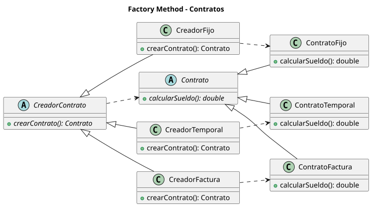
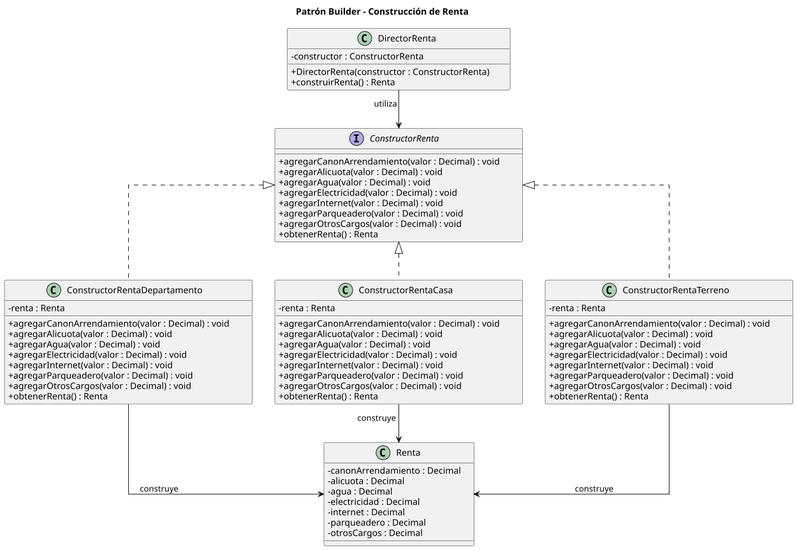
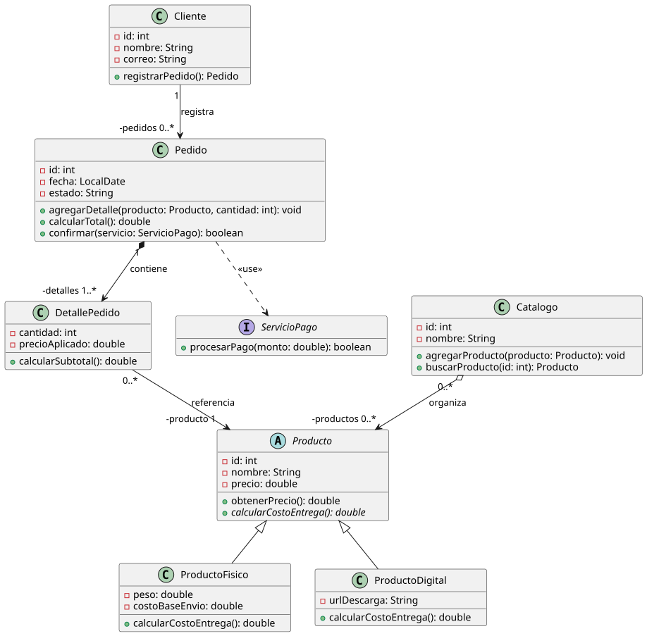

# Módulo 5 - Patrones de Diseño de Software

Actividades de clase y revisiones guiadas del módulo: diagramas de clases UML (PlantUML) y su implementación en Java con Maven y JUnit 5.

Repositorio remoto: `ups-master/class-activities-pds`.

## Estructura

```
module-5/
├── README.md
├── scripts/
│   └── generar-diagramas.sh        # genera los SVG de todos los .puml
├── diagnostic-eval/                # evaluación diagnóstica: Pedidos
│   ├── pedidos.puml, pedidos-mejorado.puml
│   ├── prompt.md, revision.md
│   └── implementacion/             # proyecto Maven
├── complete-diagram/               # diagrama completo con rúbrica UML
│   ├── pedidos.puml, pedidos_corregido.puml
│   ├── prompt.md, revision.md
│   └── implementacion/             # proyecto Maven
├── singleton/
│   ├── class-activity/             # 4 casos (solo diagramas)
│   └── guided-review/              # configuración global + proyecto Maven
├── factory-method/
│   └── guided-review/              # contratos: 3 diagramas + proyecto Maven
└── builder/
    ├── class-activity/             # reserva de vuelo (solo diagrama)
    └── guided-review/              # rentas: 3 diagramas + proyecto Maven
```

Cada carpeta tiene su propio `README.md` con los diagramas renderizados y la explicación.

## Actividades

| Carpeta | Tema | Concepto | Diagramas | Código |
|---|---|---|---|---|
| [`diagnostic-eval`](diagnostic-eval) | Tienda: clientes, pedidos, pagos | Revisión de un diagrama UML y validaciones | 2 | Java (Java 21) |
| [`complete-diagram`](complete-diagram) | Proceso de compra con catálogo y servicio de pagos | Asociación, composición, agregación, generalización, dependencia | 2 | Java 21 |
| [`singleton/class-activity`](singleton/class-activity) | Configuración, impresión, sesiones, pool de conexiones | Singleton | 4 | - |
| [`singleton/guided-review`](singleton/guided-review) | Configuración global compartida | Singleton | 1 | Java 25 |
| [`factory-method/guided-review`](factory-method/guided-review) | Contratos (fijo, temporal, por factura) | Sin patrón, Simple Factory, Factory Method | 3 | Java 25 |
| [`builder/class-activity`](builder/class-activity) | Reserva de vuelo | Builder clásico | 1 | - |
| [`builder/guided-review`](builder/guided-review) | Rentas (departamento, casa, terreno) | Sin patrón, Builder clásico, Builder fluido | 3 | Java 25 |

## Patrones

### Singleton

Una sola instancia con acceso global: constructor privado, atributo estático `instancia` y `obtenerInstancia()`. Se usa para configuración, colas de impresión, sesiones y pools de conexiones.


Más detalle: [`singleton/`](singleton).

### Factory Method

El creador abstracto declara `crearContrato()` y cada creador concreto decide qué contrato instanciar, sin que el cliente conozca la clase concreta.



Más detalle: [`factory-method/`](factory-method).

### Builder

Separa la construcción de un objeto complejo de su representación. El repo muestra la variante clásica (con Director) y la fluida.



Más detalle: [`builder/`](builder).

## Ejercicios de UML

`diagnostic-eval` y `complete-diagram` no son de un patrón concreto: parten de un enunciado y de un diagrama del equipo, que se revisa con un prompt (`prompt.md`) y cuyo resultado queda en `revision.md`.



Más detalle: [`diagnostic-eval/`](diagnostic-eval) y [`complete-diagram/`](complete-diagram).

## Requisitos

- Java 21 (proyectos de pedidos) y Java 25 (singleton, factory-method y builder)
- Maven 3.8+
- Graphviz (`dot`) solo para regenerar los diagramas

## Ejecutar los proyectos

Cada proyecto Maven se ejecuta desde su carpeta:

| Proyecto | Ruta | Clase principal | Pruebas |
|---|---|---|---|
| Pedidos (diagnóstico) | `diagnostic-eval/implementacion` | `pedidos.Main` | 16 |
| Pedidos (completo) | `complete-diagram/implementacion` | `pedidos.Main` | 18 |
| Configuración singleton | `singleton/guided-review/configuracion-singleton` | `com.ejemplo.configuracion.Main` | 8 |
| Contratos | `factory-method/guided-review/contratos-factory-method` | `com.ejemplo.contratos.Main` | 10 |
| Rentas | `builder/guided-review/rentas-builder` | `com.ejemplo.rentas.Main` | 9 |

```bash
mvn test
mvn compile exec:java -Dexec.mainClass=<clase principal>
```

## Regenerar los diagramas

Los SVG de cada carpeta `diagramas/` se generan a partir de los `.puml` con PlantUML. Si cambias un `.puml`, vuelve a ejecutar desde la raíz:

```bash
./scripts/generar-diagramas.sh
```

El script descarga `plantuml.jar` a `~/.cache/plantuml/` si no existe (o usa la ruta de la variable `PLANTUML_JAR`) y deja cada SVG en la carpeta `diagramas/` junto a su `.puml`.

## Notación UML usada

| Símbolo | Significado |
|---|---|
| `+` `-` `#` | Visibilidad pública, privada, protegida |
| `A --> B` | Asociación navegable de A hacia B |
| `A *-- B` | Composición: B no existe sin A |
| `A o-- B` | Agregación: B puede existir sin A |
| `A <\|-- B` | Generalización (B hereda de A) |
| `A <\|.. B` | Realización (B implementa la interfaz A) |
| `A ..> B` | Dependencia: A usa a B de forma temporal |
| `"1"`, `"0..1"`, `"0..*"`, `"1..*"` | Multiplicidades |
