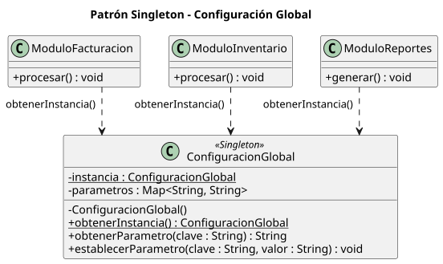

# Módulo 5 - Patrones de Diseño de Software

Actividades de clase y revisiones guiadas de la asignatura *Patrones de Diseño de Software* (Maestría en Software, UPS): diagramas de clases UML (PlantUML) y su implementación en Java con Maven y JUnit 5.

Repositorio remoto: `ups-master/class-activities-pds`.

## Objetivos y resultados de aprendizaje

- Comprender los fundamentos y la clasificación de los patrones de diseño.
- Seleccionar patrones según el problema y el contexto.
- Modelar e implementar soluciones orientadas a objetos.
- Utilizar IA como apoyo, validando críticamente sus resultados.

| RA | Resultado |
|---|---|
| RA1 | Selecciona y aplica patrones creacionales, revisando críticamente las alternativas elaboradas con IA. |
| RA2 | Modela soluciones aplicando patrones estructurales. |
| RA3 | Implementa soluciones aplicando patrones de comportamiento. |

## Unidades

| Unidad | Contenido | Estado en el repo |
|---|---|---|
| [01. Patrones creacionales](unidad-01-creacionales) | Fundamentos de patrones, POO, código limpio, Factory Method, Builder y Singleton, SOLID, uso crítico de IA | Sesiones 01 a 03 |
| 02. Patrones estructurales | Composite, Adapter, Bridge, Facade | Pendiente |
| 03. Patrones de comportamiento | Strategy, Template Method, State, Observer | Pendiente |

## Estructura

```
module-5/
├── README.md
├── scripts/
│   └── generar-diagramas.sh                 # genera los SVG de todos los .puml
└── unidad-01-creacionales/
    ├── README.md
    ├── sesion-01-fundamentos/
    │   ├── diapositivas.md
    │   └── actividad-diagnostica/           # pedidos: diagramas, revisión con IA, Java
    ├── sesion-02-diseno-clases/
    │   ├── diapositivas.md
    │   └── diagrama-completo/               # pedidos en línea: diagramas, revisión con IA, Java
    └── sesion-03-patrones-creacionales/
        ├── diapositivas.md
        ├── factory-method/   class-activity/, guided-review/
        ├── builder/          class-activity/, guided-review/
        └── singleton/        class-activity/, guided-review/
```

Cada carpeta tiene su propio `README.md` con la teoría de la diapositiva correspondiente, los diagramas renderizados y la explicación.

## Actividades

Rutas relativas a `unidad-01-creacionales/`.

| Carpeta | Tema | Concepto | Diagramas | Código |
|---|---|---|---|---|
| [`sesion-01-fundamentos/actividad-diagnostica`](unidad-01-creacionales/sesion-01-fundamentos/actividad-diagnostica) | Tienda: clientes, pedidos, pagos | Revisión de un diagrama UML y validaciones | 2 | Java 21 |
| [`sesion-02-diseno-clases/diagrama-completo`](unidad-01-creacionales/sesion-02-diseno-clases/diagrama-completo) | Pedidos en línea con catálogo y servicio de pagos | Asociación, composición, agregación, generalización, dependencia | 2 | Java 21 |
| [`sesion-03-patrones-creacionales/factory-method/class-activity`](unidad-01-creacionales/sesion-03-patrones-creacionales/factory-method/class-activity) | Logística, documentos, enemigos, reportes | Factory Method | 4 | - |
| [`sesion-03-patrones-creacionales/factory-method/guided-review`](unidad-01-creacionales/sesion-03-patrones-creacionales/factory-method/guided-review) | Contratos (fijo, temporal, por factura) | Sin patrón, Simple Factory, Factory Method | 3 | Java 25 |
| [`sesion-03-patrones-creacionales/builder/class-activity`](unidad-01-creacionales/sesion-03-patrones-creacionales/builder/class-activity) | Reserva de vuelo, personaje, reporte, menú | Builder clásico y fluido | 4 | - |
| [`sesion-03-patrones-creacionales/builder/guided-review`](unidad-01-creacionales/sesion-03-patrones-creacionales/builder/guided-review) | Rentas (departamento, casa, terreno) | Sin patrón, Builder clásico, Builder fluido | 3 | Java 25 |
| [`sesion-03-patrones-creacionales/singleton/class-activity`](unidad-01-creacionales/sesion-03-patrones-creacionales/singleton/class-activity) | Configuración, impresión, sesiones, pool de conexiones | Singleton | 4 | - |
| [`sesion-03-patrones-creacionales/singleton/guided-review`](unidad-01-creacionales/sesion-03-patrones-creacionales/singleton/guided-review) | Configuración global compartida | Singleton | 1 | Java 25 |

## Los tres patrones de la unidad

| Patrón | Responsabilidad de creación | Diagrama |
|---|---|---|
| [Factory Method](unidad-01-creacionales/sesion-03-patrones-creacionales/factory-method) | Decide **qué** objeto concreto crear, mediante herencia y polimorfismo. |  |
| [Builder](unidad-01-creacionales/sesion-03-patrones-creacionales/builder) | Organiza **cómo** construir progresivamente un objeto complejo. |  |
| [Singleton](unidad-01-creacionales/sesion-03-patrones-creacionales/singleton) | Controla **cuántas** instancias existen en un alcance. |  |

## Requisitos

- Java 21 (proyectos de pedidos) y Java 25 (singleton, factory-method y builder)
- Maven 3.8+
- Graphviz (`dot`) solo para regenerar los diagramas

## Ejecutar los proyectos

Cada proyecto Maven se ejecuta desde su carpeta. Rutas relativas a `unidad-01-creacionales/`:

| Proyecto | Ruta | Clase principal | Pruebas |
|---|---|---|---|
| Pedidos (diagnóstico) | `sesion-01-fundamentos/actividad-diagnostica/implementacion` | `pedidos.Main` | 16 |
| Pedidos (completo) | `sesion-02-diseno-clases/diagrama-completo/implementacion` | `pedidos.Main` | 18 |
| Configuración singleton | `sesion-03-patrones-creacionales/singleton/guided-review/configuracion-singleton` | `com.ejemplo.configuracion.Main` | 8 |
| Contratos | `sesion-03-patrones-creacionales/factory-method/guided-review/contratos-factory-method` | `com.ejemplo.contratos.Main` | 10 |
| Rentas | `sesion-03-patrones-creacionales/builder/guided-review/rentas-builder` | `com.ejemplo.rentas.Main` | 9 |

```bash
mvn test
mvn compile exec:java -Dexec.mainClass=<clase principal>
```

## Regenerar los diagramas

Los SVG de cada carpeta `diagramas/` se generan a partir de los `.puml` con PlantUML. Si cambias un `.puml`, vuelve a ejecutar desde la raíz:

```bash
./scripts/generar-diagramas.sh
```

El script descarga `plantuml.jar` a `~/.cache/plantuml/` si no existe (o usa la ruta de la variable `PLANTUML_JAR`) y deja cada SVG en la carpeta `diagramas/` junto a su `.puml`.

## Notación UML usada

| Símbolo | Significado |
|---|---|
| `+` `-` `#` | Visibilidad pública, privada, protegida |
| `A --> B` | Asociación navegable de A hacia B |
| `A *-- B` | Composición: B no existe sin A |
| `A o-- B` | Agregación: B puede existir sin A |
| `A <\|-- B` | Generalización (B hereda de A) |
| `A <\|.. B` | Realización (B implementa la interfaz A) |
| `A ..> B` | Dependencia: A usa a B de forma temporal |
| `"1"`, `"0..1"`, `"0..*"`, `"1..*"` | Multiplicidades |
