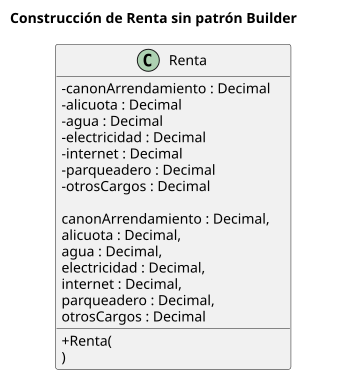
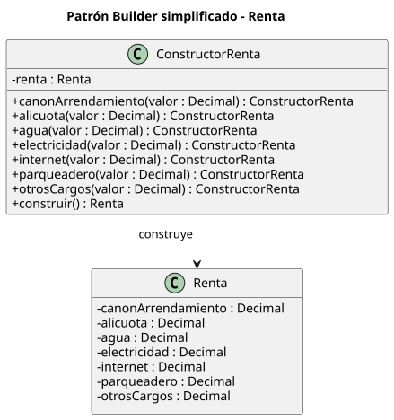

# Builder - Rentas

Construcción de objetos `Renta` (departamentos, casas y terrenos) en tres versiones:
sin patrón, Builder clásico y Builder fluido. Los diagramas están en los `.puml` de esta carpeta
y el código en `rentas-builder/`.

## Diagramas

### Sin patrón

[`rentas-sin-patron.puml`](rentas-sin-patron.puml)



Un único constructor con siete parámetros posicionales.

### Builder clásico

[`rentas-builder-clasico.puml`](rentas-builder-clasico.puml)


`DirectorRenta` fija el proceso y usa la interfaz `ConstructorRenta`. Los constructores de departamento, casa y terreno la implementan y deciden qué componentes aplican a cada tipo.

### Builder fluido

[`rentas-builder-fluido.puml`](rentas-builder-fluido.puml)



Un solo `ConstructorRenta` encadenable, sin director ni interfaz.

## Estructura

```
guided-review/
├── README.md
├── rentas-sin-patron.puml
├── rentas-builder-clasico.puml
├── rentas-builder-fluido.puml
├── diagramas/                         # SVG generados
└── rentas-builder/                    # proyecto Maven
    ├── pom.xml
    ├── src/main/java/com/ejemplo/rentas/
    │   ├── Main.java                  # demo de las tres versiones
    │   ├── sinpatron/
    │   │   └── Renta.java             # constructor con los 7 componentes
    │   ├── clasico/
    │   │   ├── Renta.java
    │   │   ├── ConstructorRenta.java  # interfaz Builder (pasos)
    │   │   ├── ConstructorRentaDepartamento.java
    │   │   ├── ConstructorRentaCasa.java
    │   │   ├── ConstructorRentaTerreno.java
    │   │   └── DirectorRenta.java     # proceso común
    │   └── fluido/
    │       ├── Renta.java
    │       └── ConstructorRenta.java  # builder encadenable
    └── src/test/java/com/ejemplo/rentas/...   # pruebas JUnit 5
```

## Requisitos

- Java 25
- Maven 3.8+ (solo para `mvn`; sin Maven ver la última sección)

Todos los comandos se ejecutan desde `rentas-builder/` (`cd rentas-builder`).

## Ejecutar la demo

```bash
mvn compile exec:java -Dexec.mainClass=com.ejemplo.rentas.Main
```

Salida esperada:

```
== Sin patrón ==
Renta{canonArrendamiento=500, alicuota=40, agua=null, electricidad=null, internet=30, parqueadero=null, otrosCargos=null}

== Builder clásico (mismo proceso, distinta configuración) ==
Departamento: Renta{canonArrendamiento=500, alicuota=40, agua=15, electricidad=25, internet=30, parqueadero=20, otrosCargos=10}
Casa:         Renta{canonArrendamiento=500, alicuota=40, agua=15, electricidad=25, internet=30, parqueadero=20, otrosCargos=10}
Terreno:      Renta{canonArrendamiento=500, alicuota=null, agua=null, electricidad=null, internet=null, parqueadero=null, otrosCargos=10}

== Builder fluido ==
Renta{canonArrendamiento=500, alicuota=40, agua=null, electricidad=null, internet=30, parqueadero=null, otrosCargos=null}
```

## Ejecutar las pruebas

```bash
mvn test
```

Resultado esperado: 9 pruebas, 0 fallos (1 sin patrón, 5 Builder clásico, 3 Builder fluido).

## Uso de cada versión

**Sin patrón.** Siete parámetros posicionales. No queda claro cuál es cuál ni cuáles son
opcionales (`null`), y nada impide combinaciones sin sentido.

```java
new Renta(BigDecimal.valueOf(500), BigDecimal.valueOf(40), null, null,
          BigDecimal.valueOf(30), null, null);
```

**Builder clásico.** El `DirectorRenta` fija el proceso común y el constructor concreto
decide qué aplica a su tipo.

```java
Renta renta = new DirectorRenta(new ConstructorRentaCasa()).construirRenta();
```

También se puede armar paso a paso sin director:

```java
ConstructorRenta c = new ConstructorRentaDepartamento();
c.agregarCanonArrendamiento(BigDecimal.valueOf(500));
c.agregarAlicuota(BigDecimal.valueOf(40));
Renta renta = c.obtenerRenta();
```

| Constructor    | Obligatorios                      | Pasos que ignora                                   |
|----------------|-----------------------------------|----------------------------------------------------|
| Departamento   | canon, alícuota                   | —                                                  |
| Casa           | canon, agua, electricidad         | —                                                  |
| Terreno        | canon                             | alícuota, agua, electricidad, internet, parqueadero |

Si falta un obligatorio, `obtenerRenta()` lanza `IllegalStateException`.

**Builder fluido.** Cada método nombra el componente y el orden no importa.

```java
Renta renta = new ConstructorRenta()
        .canonArrendamiento(BigDecimal.valueOf(500))
        .alicuota(BigDecimal.valueOf(40))
        .internet(BigDecimal.valueOf(30))
        .construir();
```

Solo el canon es obligatorio; sin él, `construir()` lanza `IllegalStateException`.

## Supuestos

- Los montos son `BigDecimal` (los diagramas dicen `Decimal`).
- Las reglas de obligatorios por tipo son un supuesto de ejemplo; el enunciado no las detalla.
- `DirectorRenta.construirRenta()` no recibe parámetros (como en el diagrama), por eso usa
  montos fijos de ejemplo (canon 500, alícuota 40, agua 15, electricidad 25, internet 30,
  parqueadero 20, otros cargos 10).

## Sin Maven (solo javac)

```bash
javac -d out $(find src/main -name '*.java')
java -cp out com.ejemplo.rentas.Main
```
