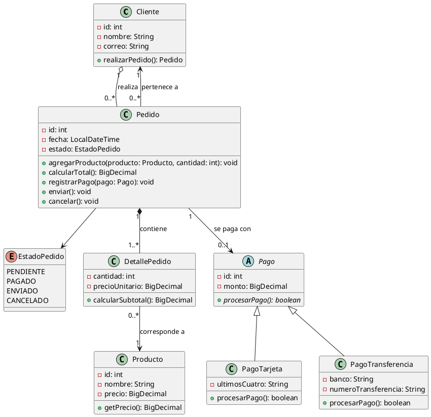

# Revisión del diagrama `pedidos.puml`

**Enunciado:** una tienda gestiona clientes, productos, pedidos y pagos.
- Un cliente puede realizar varios pedidos.
- Cada pedido pertenece a un solo cliente.
- Un pedido contiene uno o más productos y registra sus cantidades.
- El pedido calcula su total y controla los cambios de estado.
- El pago puede realizarse mediante tarjeta o transferencia.

Archivos:
- `pedidos.puml`: propuesta inicial del equipo (sin modificar).
- `implementacion/`: proyecto Java (Maven) que implementa las mejoras de esta revisión.

## Trazabilidad enunciado → modelo

| Requisito del enunciado | Original | Con mejoras |
|---|---|---|
| Un cliente realiza varios pedidos | `Cliente 1 → 0..* Pedido` ✔ | Igual, como agregación (`o--`) |
| Cada pedido pertenece a un solo cliente | ✘ No había navegabilidad `Pedido → Cliente` | `Pedido 0..* → 1 Cliente` |
| Pedido con uno o más productos y cantidades | `Pedido 1 → 1..* DetallePedido → Producto` ✔ | Composición (`*--`); el 1..* se valida al pagar |
| El pedido calcula su total | `calcularTotal()` ✔, pero también guardaba `total` | Solo `calcularTotal()` |
| El pedido controla sus cambios de estado | `estado: String` + `cambiarEstado(String)` ✘ | `enum EstadoPedido` + `registrarPago()`, `enviar()`, `cancelar()` |
| Pago por tarjeta o transferencia | `Pago <|-- PagoTarjeta / PagoTransferencia` ✔ | Igual |
| *(no está en el enunciado)* | `Producto.stock`, `actualizarStock()` | Eliminados |

## A. Aspectos correctos de nuestra propuesta

- Cinco clases del dominio, cada una con responsabilidad clara: `Cliente`, `Producto`, `Pedido`, `DetallePedido`, `Pago`. Ninguna sobra.
- `DetallePedido` como clase de asociación entre `Pedido` y `Producto`. Es la solución correcta porque la relación lleva datos propios (`cantidad`, `precioUnitario`).
- `precioUnitario` conserva el precio al momento de la compra, aunque el `Producto` cambie de precio después.
- Atributos privados en todas las clases.
- La herencia de `Pago` cumple "es un". Cada subclase tiene atributos y comportamiento propios, así que no se usa solo para reutilizar código.
- `Cliente 1 → 0..* Pedido` y `Pedido 1 → 0..1 Pago` son correctas. Un pedido sin pagar no tiene pago.

## B. Errores o inconsistencias encontradas

| # | Problema | Consecuencia |
|---|----------|--------------|
| 1 | Falta `Pedido → Cliente` | El enunciado dice que cada pedido pertenece a **un solo** cliente y el modelo no lo expresa. |
| 2 | `Pedido.estado: String` y `cambiarEstado(String)` público | Admite textos arbitrarios y saltos inválidos (ENVIADO → PENDIENTE). El enunciado pide que el pedido **controle** sus cambios de estado. |
| 3 | `Pedido.total` almacenado junto a `calcularTotal()` | Dato redundante que puede quedar desincronizado de los detalles. |
| 4 | `double` para dinero | Errores de redondeo. Debe ser `BigDecimal`. |
| 5 | `Date` | Clase obsoleta. Usar `LocalDateTime`. |
| 6 | `Producto.stock` y `actualizarStock(int)` | El enunciado no menciona inventario. Además `actualizarStock` es ambiguo y permite stock negativo. Añade responsabilidad y acoplamiento que nadie pidió. |
| 7 | `Pedido ..> Producto : usa` | Redundante: `Pedido` ya llega a `Producto` por `DetallePedido`. |
| 8 | `Pedido → DetallePedido` como asociación simple | El detalle no existe sin su pedido: es composición. |
| 9 | `Pago.monto` sin relación con el total | Se puede pagar un monto distinto del total del pedido. |
| 10 | `PagoTarjeta.numeroTarjeta` guarda el número completo | Riesgo de seguridad. Bastan los últimos 4 dígitos. |
| 11 | `Pedido 1 → 1..* DetallePedido` | Un pedido recién creado tiene 0 detalles. La regla "al menos un producto" se valida al pagar, no en el constructor. |
| 12 | `Cliente.realizarPedido()` solo devuelve un `Pedido` | Debe registrarlo en el cliente y asignarle ese cliente. |

## C. Mejoras recomendadas

1. **`enum EstadoPedido`** con `PENDIENTE`, `PAGADO`, `ENVIADO`, `CANCELADO` y `puedeTransicionarA(...)`. El enunciado no fija los estados; se eligieron los mínimos de un flujo de tienda.
   - `PENDIENTE → PAGADO | CANCELADO`
   - `PAGADO → ENVIADO | CANCELADO`
   - `ENVIADO` y `CANCELADO` son finales.
2. **Sustituir `cambiarEstado(String)`** por operaciones de negocio que validan la transición: `registrarPago(Pago)`, `enviar()`, `cancelar()`.
3. **Eliminar `total`.** Se calcula siempre desde los detalles.
4. **`BigDecimal` y `LocalDateTime`.**
5. **Quitar el stock** de `Producto`. Si el enunciado lo pidiera, se reincorporaría con `descontarStock` / `reponerStock` validados.
6. **Corregir relaciones:**
   - `Cliente "1" o-- "0..*" Pedido`
   - `Pedido "0..*" --> "1" Cliente`
   - `Pedido "1" *-- "1..*" DetallePedido`
   - `DetallePedido "0..*" --> "1" Producto`
   - `Pedido "1" --> "0..1" Pago`
   - Eliminar `Pedido ..> Producto`.
7. **Validaciones dentro de las clases:**
   - `Cliente`: nombre no vacío y correo con formato válido.
   - `Producto`: nombre no vacío y precio > 0.
   - `DetallePedido`: cantidad > 0.
   - `Pago`: monto > 0.
   - `PagoTarjeta`: 16 dígitos.
   - `PagoTransferencia`: banco y número no vacíos.
8. **Visibilidad:**
   - Atributos `private`.
   - Colecciones expuestas con `unmodifiableList`.
   - Constructores de `Pedido` y `DetallePedido` con visibilidad de paquete: solo se crean desde `Cliente.realizarPedido()` y `Pedido.agregarProducto()`.

Diagrama resultante de aplicar estas mejoras (no sustituye a `pedidos.puml`):



## D. Patrón de diseño que podría aplicar y justificación

**No se recomienda añadir ningún patrón nuevo.** El único problema concreto que un patrón resuelve ya está resuelto en el modelo:

- **Strategy (implícito en `Pago`).**
  - *Problema:* el pedido debe poder pagarse con medios distintos sin que `Pedido` conozca los detalles de cada uno. El enunciado pide dos (tarjeta y transferencia).
  - *Participantes:* `Pedido` (contexto), `Pago` (estrategia abstracta), `PagoTarjeta` y `PagoTransferencia` (estrategias concretas).
  - *Por qué mejora el diseño:* `Pedido.registrarPago(Pago)` llama a `procesarPago()` de forma polimórfica y no tiene `if (tipo == ...)`. Añadir un medio nuevo no modifica `Pedido`.
  - *Desventaja:* una jerarquía de clases más. El coste es bajo porque cada subclase tiene atributos propios.

Es lo que ya proponía el diagrama original, así que se conserva.

## E. Recomendaciones que NO son necesarias o que podrían sobrecomplicar el diseño

- **State (una clase por estado).** Son 4 estados con transiciones simples y sin comportamiento distinto por estado. Un `enum` con `puedeTransicionarA` basta.
- **Observer** (notificar al cliente al cambiar el estado). El enunciado no lo pide.
- **Factory Method** para crear pagos. Los constructores son simples y el cliente sabe qué medio usa.
- **Template Method** en `Pago`. Las dos subclases no comparten un algoritmo con pasos intercambiables.
- **Inventario / stock.** No está en el enunciado.
- **Clases `Carrito`, `Direccion`, `Factura`, `Envio`.** Ninguna aparece en el problema.
- **Interfaces** para `Producto` o `Cliente`. Hay una sola implementación de cada una.
- **Repository / DAO.** Es persistencia, fuera del alcance de un diagrama de clases.
- **Jerarquía de `Producto`** (físico, digital). No hay necesidad.

## F. Ejemplo de una operación con validación

Operación: `Pedido.registrarPago(Pago)`. Combina reglas de estado, de integridad y de negocio.

Validaciones:
1. El pedido debe estar `PENDIENTE`. Esto cubre también el pago doble, porque `PAGADO → PAGADO` no es una transición válida.
2. El pedido debe tener al menos un producto (multiplicidad `1..*`).
3. El pago no puede ser `null`.
4. El monto debe ser igual al total del pedido.
5. El pago debe procesarse con éxito. Si se rechaza, el pedido no cambia.

```java
public void registrarPago(Pago nuevoPago) {
    verificarTransicion(EstadoPedido.PAGADO);                      // 1. solo desde PENDIENTE
    if (detalles.isEmpty()) {                                      // 2.
        throw new IllegalStateException("No se puede pagar un pedido sin productos");
    }
    if (nuevoPago == null) {                                       // 3.
        throw new IllegalArgumentException("El pago es obligatorio");
    }
    if (nuevoPago.getMonto().compareTo(calcularTotal()) != 0) {    // 4.
        throw new IllegalArgumentException("El monto del pago (" + nuevoPago.getMonto()
            + ") no coincide con el total del pedido (" + calcularTotal() + ")");
    }
    if (!nuevoPago.procesarPago()) {                               // 5.
        throw new IllegalStateException("El pago fue rechazado");
    }
    pago = nuevoPago;                                              // el estado cambia solo si todo salió bien
    estado = EstadoPedido.PAGADO;
}
```

Todas las comprobaciones ocurren antes de modificar el objeto, así que nunca queda a medias.

## Cómo ejecutar la implementación

```bash
cd implementacion
mvn test                  # 16 pruebas JUnit 5
mvn compile exec:java     # ejecuta pedidos.Main
```
