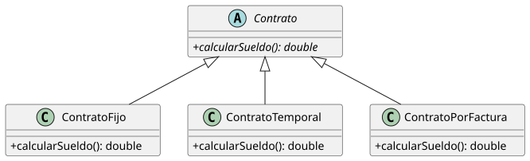
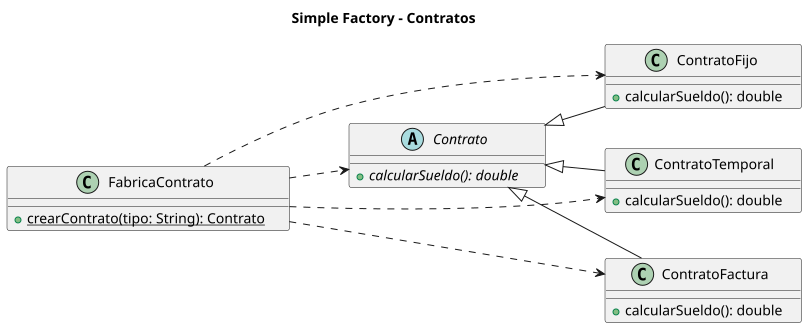

# Factory Method - Contratos

Implementación en Java del patrón **Factory Method** descrita en `contracts-with-fm.puml`.

## Diagramas

Se comparan tres diseños del mismo problema (calcular el sueldo según el tipo de contrato).

### 1. Sin patrón

[`contracts-no-fm.puml`](contracts-no-fm.puml)



Jerarquía `Contrato` con tres subclases. El cliente hace `new` de la clase concreta, así que queda acoplado a ella.

### 2. Simple Factory

[`contracts-simple-factory.puml`](contracts-simple-factory.puml)



`FabricaContrato.crearContrato(tipo: String)` centraliza la creación, pero depende de todos los contratos concretos y hay que modificarla (con un `if`/`switch`) cada vez que aparece un tipo nuevo.

### 3. Factory Method

[`contracts-with-fm.puml`](contracts-with-fm.puml)


Cada `Creador` concreto redefine `crearContrato()` y devuelve su propio contrato. Añadir un tipo nuevo es añadir un contrato y su creador, sin tocar código existente. Es el diseño implementado en Java.

## Estructura

Estas carpetas cuelgan de `factory-method/guided-review/`. El código está en `contratos-factory-method/`.

```
contratos-factory-method/src/main/java/com/ejemplo/contratos/
├── Main.java
├── modelo/                  # Productos
│   ├── Contrato.java        (abstracta: calcularSueldo())
│   ├── ContratoFijo.java
│   ├── ContratoTemporal.java
│   └── ContratoFactura.java
└── creador/                 # Creadores (factory method: crearContrato())
    ├── CreadorContrato.java (abstracta)
    ├── CreadorFijo.java
    ├── CreadorTemporal.java
    └── CreadorFactura.java
contratos-factory-method/src/test/java/...          # Pruebas JUnit 5
```

| Creador            | Producto            | Cálculo del sueldo                       |
|--------------------|---------------------|------------------------------------------|
| `CreadorFijo`      | `ContratoFijo`      | `salarioMensual`                         |
| `CreadorTemporal`  | `ContratoTemporal`  | `salarioMensual * (1 - 0.10)` (retención) |
| `CreadorFactura`   | `ContratoFactura`   | `horas * tarifaPorHora`                  |

> El diagrama solo define `calcularSueldo(): double`. Las fórmulas y los datos de
> cada contrato son supuestos de ejemplo; cada creador recibe sus datos por
> constructor porque `crearContrato()` no tiene parámetros.

## Requisitos

- Java 25
- Maven 3.8+ (solo para compilar y ejecutar las pruebas con `mvn`)

## Uso

Los comandos se ejecutan desde `contratos-factory-method/` (`cd contratos-factory-method`).

```java
CreadorContrato creador = new CreadorTemporal(1500);
Contrato contrato = creador.crearContrato();
double sueldo = contrato.calcularSueldo(); // 1350.0
```

El cliente depende solo de `CreadorContrato` y `Contrato`. Para soportar un nuevo
tipo de contrato basta con crear un `Contrato` y su `Creador`, sin modificar código existente.

### Ejecutar la demo

```bash
mvn compile exec:java -Dexec.mainClass=com.ejemplo.contratos.Main
```

Salida:

```
ContratoFijo -> sueldo: 2000.00
ContratoTemporal -> sueldo: 1350.00
ContratoFactura -> sueldo: 2000.00
```

### Ejecutar las pruebas

```bash
mvn test
```

### Sin Maven (solo javac)

```bash
javac -d out $(find src/main -name '*.java')
java -cp out com.ejemplo.contratos.Main
```
