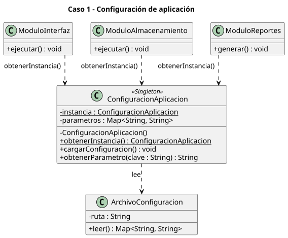
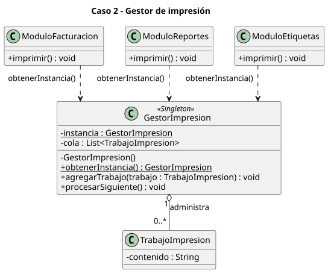
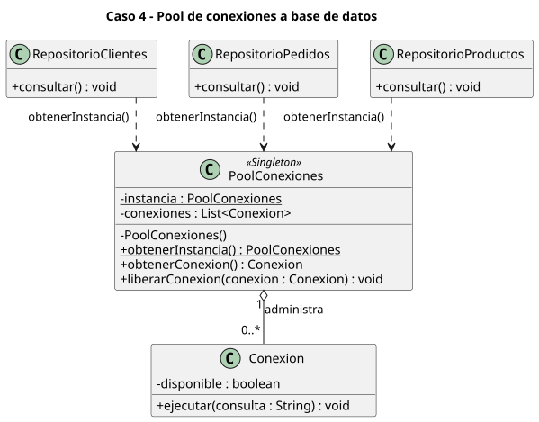

# Singleton - Actividad de clase

Cuatro casos en los que conviene tener una única instancia. Cada uno se modela con un diagrama de clases UML (sin código).

Todos comparten la misma estructura: la clase `<<Singleton>>` tiene un atributo estático `instancia`, un constructor privado y `obtenerInstancia()`. Los módulos que la usan tienen una **dependencia** (`..>`) hacia ella.

```
class-activity/
├── README.md
├── configuracion-aplicacion.puml
├── gestor-impresion.puml
├── sesion-usuario.puml
├── acceso-base-datos.puml
└── diagramas/               # SVG generados
```

## Caso 1 - Configuración de aplicación

[`configuracion-aplicacion.puml`](configuracion-aplicacion.puml)



`ConfiguracionAplicacion` carga los parámetros desde un `ArchivoConfiguracion` y los entrega a `ModuloInterfaz`, `ModuloAlmacenamiento` y `ModuloReportes`. Una sola instancia evita leer el archivo varias veces y que cada módulo vea valores distintos.

## Caso 2 - Gestor de impresión

[`gestor-impresion.puml`](gestor-impresion.puml)



`GestorImpresion` mantiene la cola de `TrabajoImpresion` (agregación `1 o-- 0..*`). Facturación, reportes y etiquetas envían sus trabajos al mismo gestor, de modo que la cola es única y se procesa en orden.

## Caso 3 - Gestión de sesiones de usuario

[`sesion-usuario.puml`](sesion-usuario.puml)


`GestorSesiones` administra las `SesionUsuario` activas (agregación `1 o-- 0..*`). Cada sesión pertenece a un `Usuario`. `ModuloAutenticacion` crea sesiones y `ModuloAplicacion` las consulta, por lo que ambos necesitan el mismo registro.

## Caso 4 - Pool de conexiones a base de datos

[`acceso-base-datos.puml`](acceso-base-datos.puml)



`PoolConexiones` administra un conjunto de `Conexion` (agregación `1 o-- 0..*`) que se prestan y se liberan. Los repositorios de clientes, pedidos y productos comparten el pool en lugar de abrir conexiones propias.

## Resumen de relaciones

| Elemento | Relación | Significado |
|---|---|---|
| Módulo `..>` Singleton | Dependencia | El módulo usa el Singleton llamando a `obtenerInstancia()`; no lo guarda como atributo. |
| Singleton `1 o-- 0..*` Elemento | Agregación | El Singleton agrupa elementos (trabajos, sesiones, conexiones) que son objetos con entidad propia. |
| `SesionUsuario 0..* --> 1 Usuario` | Asociación | Cada sesión conoce a su usuario. |
