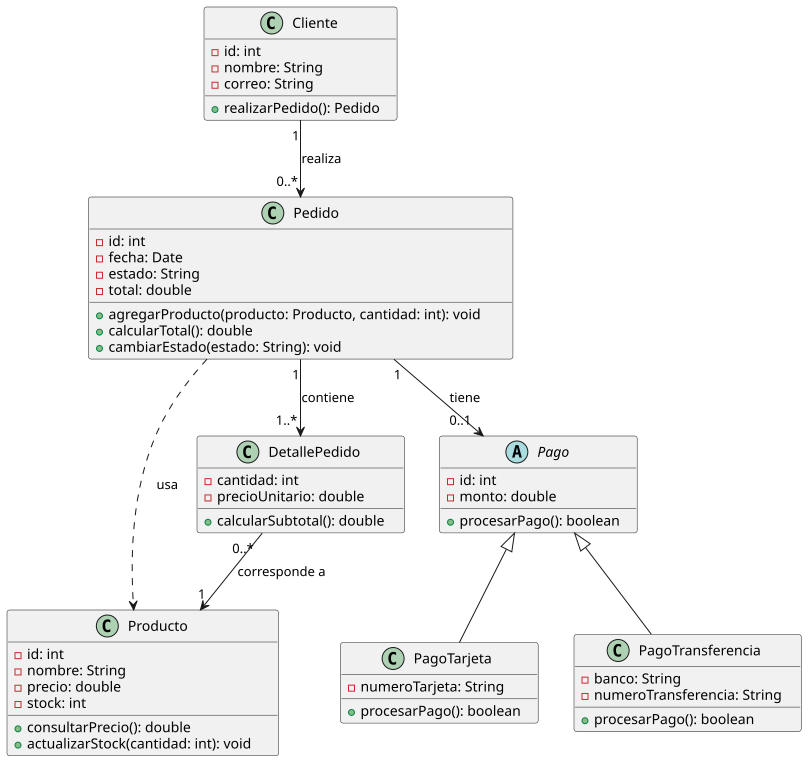
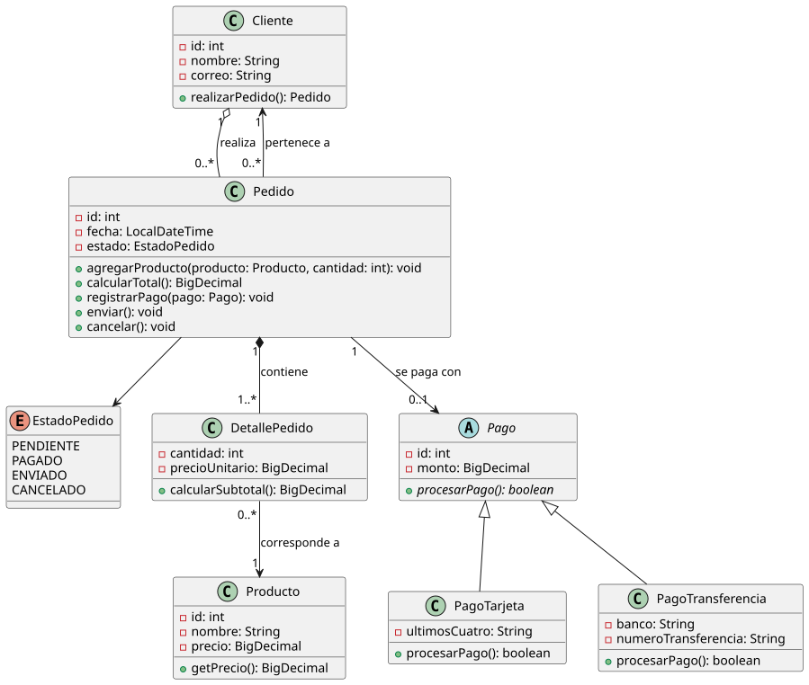

# Evaluación diagnóstica - Pedidos

Revisión de un diagrama de clases UML de una tienda (clientes, productos, pedidos y pagos) y su implementación en Java con las mejoras aplicadas.

## Enunciado

Una tienda gestiona clientes, productos, pedidos y pagos.

- Un cliente puede realizar varios pedidos.
- Cada pedido pertenece a un solo cliente.
- Un pedido contiene uno o más productos y registra sus cantidades.
- El pedido calcula su total y controla los cambios de estado.
- El pago puede realizarse mediante tarjeta o transferencia.

## Contenido

```
actividad-diagnostica/
├── README.md
├── prompt.md               # prompt usado para que una IA actúe como revisora
├── revision.md             # resultado de la revisión (secciones A-F)
├── pedidos.puml            # propuesta inicial del equipo (sin modificar)
├── pedidos-mejorado.puml   # modelo con las mejoras (extraído de revision.md)
├── diagramas/              # SVG generados
└── implementacion/         # proyecto Maven (Java) del modelo mejorado
```

## Diagrama original

Propuesta inicial del equipo ([`pedidos.puml`](pedidos.puml)).



Problemas que detectó la revisión (detalle en [`revision.md`](revision.md)):

- `Pedido.estado` es un `String` con `cambiarEstado(String)` público: admite estados inválidos.
- `Pedido.total` está almacenado y también se calcula con `calcularTotal()`.
- Falta la navegación `Pedido → Cliente`, que el enunciado exige.
- `double` para dinero y `Date` obsoleta.
- `Producto.stock` no aparece en el enunciado.
- `Pedido ..> Producto` es redundante: ya llega a `Producto` por `DetallePedido`.
- `Pago.monto` no tiene relación con el total del pedido.

## Diagrama mejorado

Modelo con las mejoras ([`pedidos-mejorado.puml`](pedidos-mejorado.puml)).



| Relación | Tipo | Justificación |
|---|---|---|
| `Cliente 1 o-- 0..* Pedido` | Agregación | Un cliente agrupa sus pedidos. |
| `Pedido 0..* --> 1 Cliente` | Asociación | Cada pedido pertenece a un solo cliente. |
| `Pedido 1 *-- 1..* DetallePedido` | Composición | El detalle no existe sin su pedido. |
| `DetallePedido 0..* --> 1 Producto` | Asociación | El detalle registra un producto y su cantidad. |
| `Pedido 1 --> 0..1 Pago` | Asociación | Un pedido sin pagar no tiene pago. |
| `Pago <\|-- PagoTarjeta / PagoTransferencia` | Generalización | Cada subclase es un "es un" `Pago` con datos propios. |
| `Pedido --> EstadoPedido` | Asociación | El estado pasa a ser un `enum` con transiciones controladas. |

## Implementación

El proyecto `implementacion/` (Maven, paquete `pedidos`) traduce el modelo mejorado a Java: `EstadoPedido` con `puedeTransicionarA(...)`, `BigDecimal` para dinero, `LocalDateTime` para fechas y operaciones de negocio (`registrarPago`, `enviar`, `cancelar`) que validan cada cambio de estado.

Requisitos: Java 21 y Maven 3.8+. Los comandos se ejecutan desde `implementacion/`.

```bash
mvn compile exec:java -Dexec.mainClass=pedidos.Main
mvn test
```

Resultado esperado: 16 pruebas, 0 fallos.
