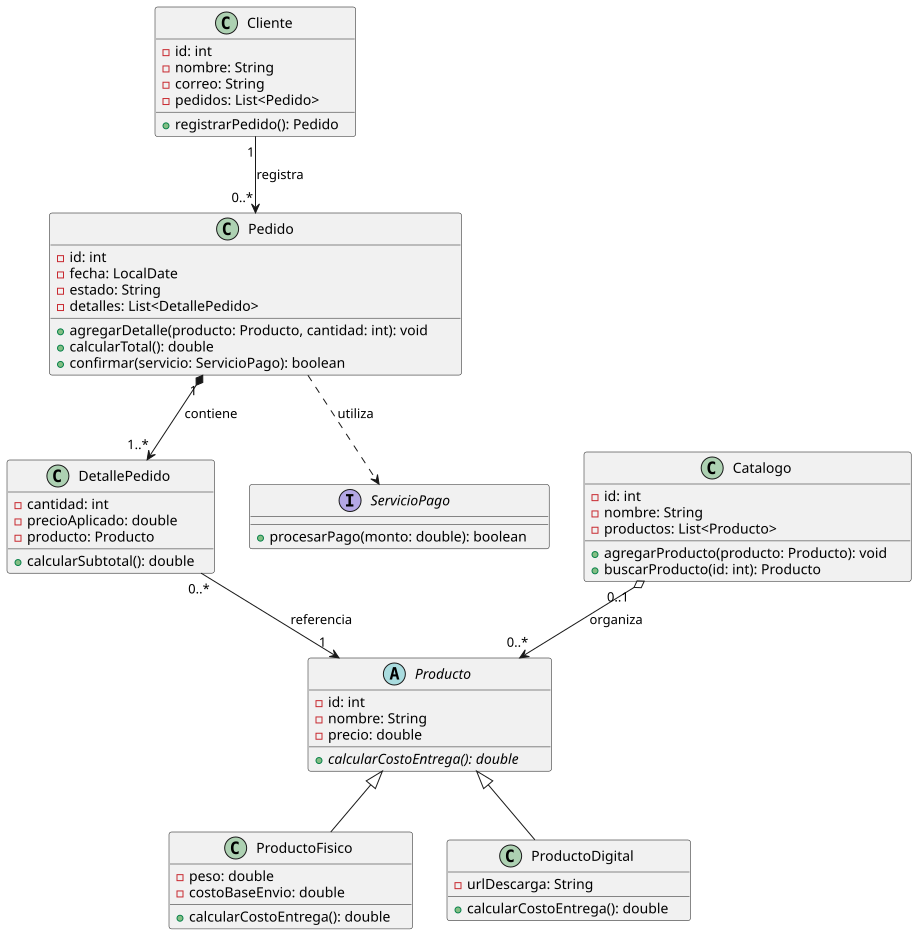

# Diagrama completo - Proceso de compra

Diagrama de clases UML de una tienda que cubre los elementos de la rúbrica: asociación, composición, agregación, generalización y dependencia, con visibilidad, tipos, multiplicidades y navegabilidad.

## Enunciado

- Un cliente puede registrar varios pedidos.
- Cada pedido contiene uno o más detalles; cada detalle registra un producto, la cantidad y el precio aplicado.
- Los productos pueden ser físicos o digitales y calculan su costo de entrega de manera diferente.
- Un catálogo organiza los productos disponibles, aunque estos pueden existir independientemente del catálogo.
- Para confirmar un pedido, el sistema utiliza un servicio externo de pagos.
- Los atributos sensibles deben permanecer encapsulados.

## Contenido

```
diagrama-completo/
├── README.md
├── prompt.md               # prompt de revisión con la rúbrica y el enunciado
├── revision.md             # revisión del diagrama contra la rúbrica
├── pedidos.puml            # propuesta del grupo
├── pedidos_corregido.puml  # propuesta tras aplicar la revisión
├── diagramas/              # SVG generados
└── implementacion/         # proyecto Maven (Java)
```

## Propuesta del grupo

[`pedidos.puml`](pedidos.puml)



| Clase A | Relación | Clase B | Mult. A | Mult. B | Navegabilidad | Justificación |
|---|---|---|---|---|---|---|
| Cliente | Asociación | Pedido | 1 | 0..* | Cliente → Pedido | Un cliente puede registrar varios pedidos, o ninguno. |
| Pedido | Composición | DetallePedido | 1 | 1..* | Pedido → DetallePedido | El detalle no existe sin su pedido. |
| DetallePedido | Asociación | Producto | 0..* | 1 | DetallePedido → Producto | Cada detalle registra un producto. |
| Catalogo | Agregación | Producto | 0..1 | 0..* | Catalogo → Producto | Los productos existen sin el catálogo. |
| Producto | Generalización | ProductoFisico, ProductoDigital | - | - | - | Relación "es un"; cada subclase redefine `calcularCostoEntrega()`. |
| Pedido | Dependencia | ServicioPago | - | - | Pedido ⇢ ServicioPago | `ServicioPago` solo es parámetro de `confirmar()`. |

## Propuesta corregida

[`pedidos_corregido.puml`](pedidos_corregido.puml)


Cambios respecto a la propuesta original, según [`revision.md`](revision.md):

| Cambio | Motivo |
|---|---|
| Se eliminan los atributos `pedidos`, `detalles`, `producto` y `productos` | Ya los representan los extremos de las asociaciones; mostrarlos dos veces es redundante. |
| Los extremos llevan el nombre del atributo (`-pedidos`, `-detalles`, ...) | Se conserva la información de qué atributo implementa cada asociación. |
| Multiplicidad `Catalogo "0..*"` en lugar de `0..1` | El enunciado no dice que un producto pertenezca a un solo catálogo. |
| `+obtenerPrecio(): double` en `Producto` | `precio` es privado y `DetallePedido` necesita copiarlo a `precioAplicado`. |
| Estereotipo `<<use>>` en la dependencia | Hace explícito que es una dependencia de uso. |

## Implementación

`implementacion/` (Maven, Java 21, paquete `pedidos`) implementa [`pedidos_corregido.puml`](pedidos_corregido.puml). Sigue los tipos del diagrama (`double`, `LocalDate`, `estado: String`).

| Diagrama | Java | Detalle |
|---|---|---|
| `Cliente 1 → 0..* Pedido` | `Cliente.registrarPedido()` | Crea el pedido y lo guarda en `-pedidos`. |
| `Pedido 1 *→ 1..* DetallePedido` | `Pedido.agregarDetalle(...)` | Composición: solo `Pedido` crea sus detalles (constructor de paquete) y los expone como lista inmodificable. |
| `DetallePedido → Producto` | `DetallePedido` | Copia `producto.obtenerPrecio()` a `precioAplicado`. |
| `Catalogo o→ Producto` | `Catalogo.agregarProducto(...)` | Agregación: recibe productos creados fuera; el mismo producto puede estar en varios catálogos. `buscarProducto(id)` devuelve `null` si no existe. |
| `Producto <\|-- ProductoFisico / ProductoDigital` | clase abstracta `Producto` | Físico: `costoBaseEnvio + peso * 1.0`; digital: `0`. |
| `Pedido ..> ServicioPago` | `Pedido.confirmar(ServicioPago)` | Dependencia: el servicio es un parámetro y no se guarda. No hay clase que lo implemente porque es un servicio externo; en `Main` y en las pruebas se usa una lambda. |

Supuestos de ejemplo (el enunciado no los fija):

- El costo de entrega se cobra por unidad: `calcularSubtotal() = cantidad * (precioAplicado + producto.calcularCostoEntrega())`. Así queda definido quién usa `calcularCostoEntrega()` (punto B2 de `revision.md`).
- `estado` toma los valores `"PENDIENTE"` y `"CONFIRMADO"`. `confirmar` exige un pedido pendiente, con al menos un detalle, y solo pasa a `CONFIRMADO` si el servicio aprueba el pago; si lo rechaza, devuelve `false` y el pedido sigue pendiente.
- La tarifa por kilo (`1.0`) es una constante de `ProductoFisico`.

Requisitos: Java 21 y Maven 3.8+. Desde `implementacion/`:

```bash
mvn compile exec:java -Dexec.mainClass=pedidos.Main
mvn test
```

Resultado esperado: 18 pruebas, 0 fallos.
