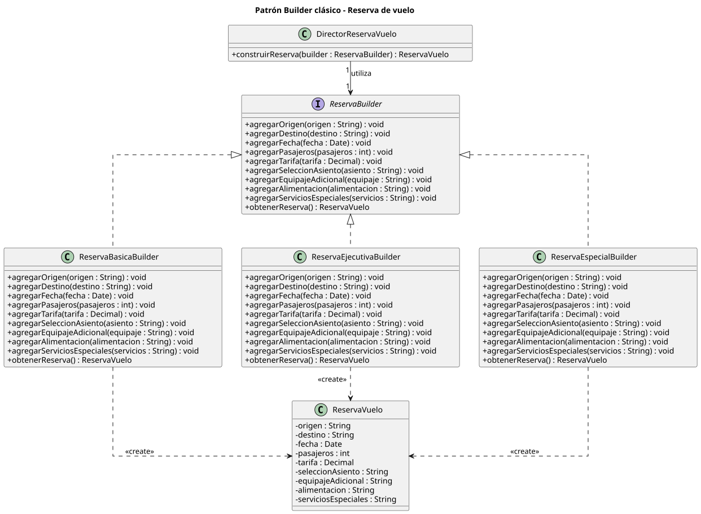
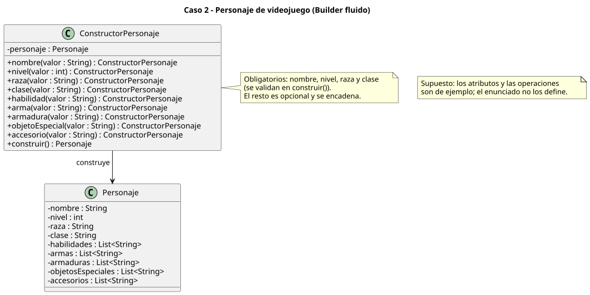
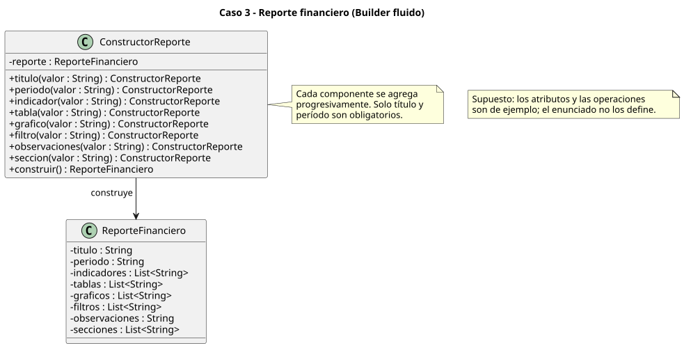
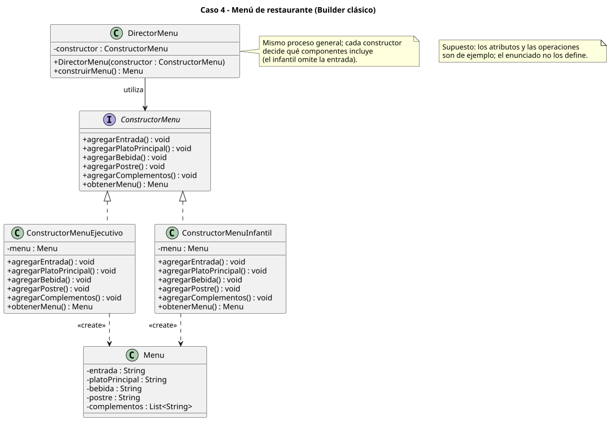

# Builder - Actividad de clase

Cuatro casos de la diapositiva 22 (*¿Builder?*), modelados con diagramas UML (sin código). Se usa la variante clásica (con Director) cuando el enunciado pide un mismo proceso con configuraciones distintas, y la fluida cuando lo que se busca es evitar constructores con demasiados parámetros.

```
class-activity/
├── README.md
├── reserva-vuelo.puml
├── personaje-videojuego.puml
├── reporte-financiero.puml
├── menu-restaurante.puml
└── diagramas/                 # SVG generados
```

| Caso | Variante | Por qué |
|---|---|---|
| 1. Reserva de vuelo | Clásica | Tres tipos de reserva (básica, ejecutiva, especial) con un proceso común. |
| 2. Personaje de videojuego | Fluida | Muchos atributos opcionales; se evita un constructor largo. |
| 3. Reporte financiero | Fluida | Los componentes se agregan progresivamente y son opcionales. |
| 4. Menú de restaurante | Clásica | Mismo proceso general con distintos menús. |

## Caso 1 - Reserva de vuelo

Una reserva tiene origen, destino, fecha, pasajeros y tarifa, y puede incluir asiento, equipaje adicional, alimentación y servicios especiales.

[`reserva-vuelo.puml`](reserva-vuelo.puml)



| Rol | Clase |
|---|---|
| Producto | `ReservaVuelo` |
| Builder | `ReservaBuilder` (interfaz, un `agregarX(...)` por componente y `obtenerReserva()`) |
| ConcreteBuilder | `ReservaBasicaBuilder`, `ReservaEjecutivaBuilder`, `ReservaEspecialBuilder` |
| Director | `DirectorReservaVuelo` (`construirReserva(builder)`) |

Relaciones: los builders **realizan** la interfaz (`<|..`), el director tiene una asociación con `ReservaBuilder` (conoce solo la interfaz) y cada builder tiene una dependencia `<<create>>` hacia `ReservaVuelo`.

## Caso 2 - Personaje de videojuego

Un personaje tiene nombre, nivel, raza, clase y habilidades, y puede incorporar armas, armaduras, objetos especiales y accesorios.

[`personaje-videojuego.puml`](personaje-videojuego.puml)



`ConstructorPersonaje` expone un método por componente que devuelve el propio constructor, y `construir()` entrega el `Personaje`. Nombre, nivel, raza y clase son obligatorios y se validan en `construir()`; el resto es opcional y se encadena.

```java
Personaje p = new ConstructorPersonaje()
        .nombre("Aria").nivel(5).raza("Elfo").clase("Arquera")
        .arma("Arco largo").accesorio("Capa")
        .construir();
```

## Caso 3 - Reporte financiero

Un reporte puede incluir título, período, indicadores, tablas, gráficos, filtros, observaciones y secciones opcionales.

[`reporte-financiero.puml`](reporte-financiero.puml)



`ConstructorReporte` agrega cada componente de forma progresiva; solo título y período son obligatorios.

## Caso 4 - Menú de restaurante

Un menú se compone de entrada, plato principal, bebida, postre y complementos, con partes opcionales y distintas configuraciones.

[`menu-restaurante.puml`](menu-restaurante.puml)



| Rol | Clase |
|---|---|
| Producto | `Menu` |
| Builder | `ConstructorMenu` (interfaz) |
| ConcreteBuilder | `ConstructorMenuEjecutivo`, `ConstructorMenuInfantil` |
| Director | `DirectorMenu` (`construirMenu()`) |

El director sigue siempre el mismo proceso; cada constructor decide qué incluye (por ejemplo, el infantil omite la entrada).

## Supuesto

Las diapositivas no fijan atributos ni tipos exactos. Los de los casos 2, 3 y 4 (y los tipos `String`/`List<String>`) son un ejemplo razonable, igual que los obligatorios de cada caso.
