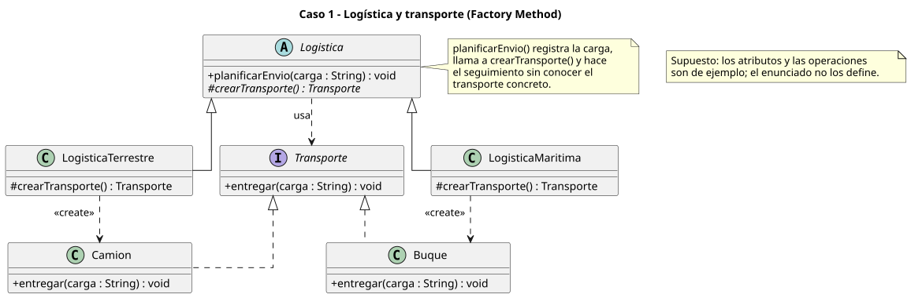
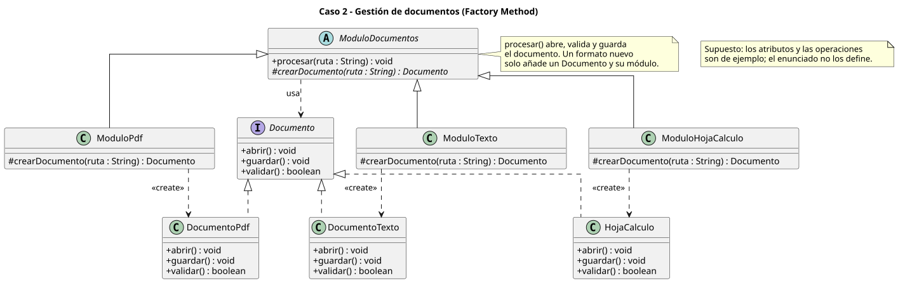
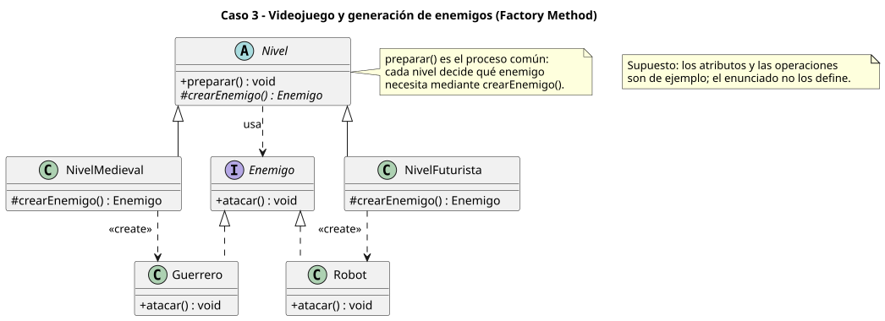
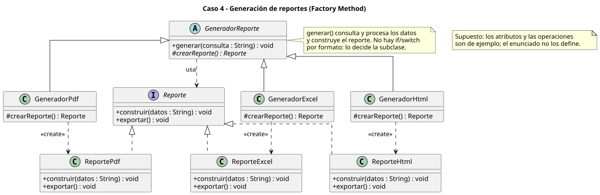

# Factory Method - Actividad de clase

Cuatro casos de la diapositiva 15 (*¿Aplicarían Factory Method?*). En los cuatro hay un proceso común que no debe depender de la clase concreta del objeto que usa, y los tipos pueden crecer. Cada uno se modela con un diagrama UML (sin código).

Estructura común:

- `Creator` abstracto con una **operación de proceso** y el factory method abstracto (`#`, protegido: lo redefinen las subclases).
- Un `ConcreteCreator` por tipo, con dependencia `<<create>>` hacia su producto concreto.
- Un `Product` (interfaz) que el creador usa mediante una dependencia `..>`.

```
class-activity/
├── README.md
├── logistica-transporte.puml
├── gestion-documentos.puml
├── videojuego-enemigos.puml
├── generacion-reportes.puml
└── diagramas/                 # SVG generados
```

## Caso 1 - Logística y transporte

Una empresa gestiona entregas terrestres (camiones) y marítimas (buques) y podrían sumarse otros medios. El proceso de envío registra la carga, asigna un transporte y hace seguimiento.

[`logistica-transporte.puml`](logistica-transporte.puml)



| Rol | Clase |
|---|---|
| Product | `Transporte` |
| ConcreteProduct | `Camion`, `Buque` |
| Creator | `Logistica` (`planificarEnvio()` + `crearTransporte()`) |
| ConcreteCreator | `LogisticaTerrestre`, `LogisticaMaritima` |

Un medio nuevo (por ejemplo, avión) añade un producto y su creador, sin tocar `planificarEnvio()`.

## Caso 2 - Gestión de documentos

Una plataforma procesa PDF, texto y hojas de cálculo con operaciones comunes (abrir, guardar, validar) y podrían aparecer formatos nuevos.

[`gestion-documentos.puml`](gestion-documentos.puml)



| Rol | Clase |
|---|---|
| Product | `Documento` |
| ConcreteProduct | `DocumentoPdf`, `DocumentoTexto`, `HojaCalculo` |
| Creator | `ModuloDocumentos` (`procesar()` + `crearDocumento()`) |
| ConcreteCreator | `ModuloPdf`, `ModuloTexto`, `ModuloHojaCalculo` |

El flujo de procesamiento no cambia al añadir un formato.

## Caso 3 - Videojuego y generación de enemigos

Todos los niveles siguen el mismo proceso de preparación, pero cada uno necesita enemigos distintos (guerreros en el medieval, robots en el futurista).

[`videojuego-enemigos.puml`](videojuego-enemigos.puml)



| Rol | Clase |
|---|---|
| Product | `Enemigo` |
| ConcreteProduct | `Guerrero`, `Robot` |
| Creator | `Nivel` (`preparar()` + `crearEnemigo()`) |
| ConcreteCreator | `NivelMedieval`, `NivelFuturista` |

Cada nivel determina qué objetos concretos necesita.

## Caso 4 - Generación de reportes

Un sistema genera reportes académicos, financieros y administrativos en PDF, Excel o HTML. El proceso consulta, procesa y construye el reporte.

[`generacion-reportes.puml`](generacion-reportes.puml)



| Rol | Clase |
|---|---|
| Product | `Reporte` |
| ConcreteProduct | `ReportePdf`, `ReporteExcel`, `ReporteHtml` |
| Creator | `GeneradorReporte` (`generar()` + `crearReporte()`) |
| ConcreteCreator | `GeneradorPdf`, `GeneradorExcel`, `GeneradorHtml` |

No hay condicionales por formato repetidos: cada generador sabe qué reporte crea.

## Supuesto

El enunciado de la diapositiva no detalla atributos ni operaciones. Los nombres de las operaciones de cada producto (`entregar`, `abrir`/`guardar`/`validar`, `atacar`, `construir`/`exportar`) son un ejemplo razonable, no un requisito.
