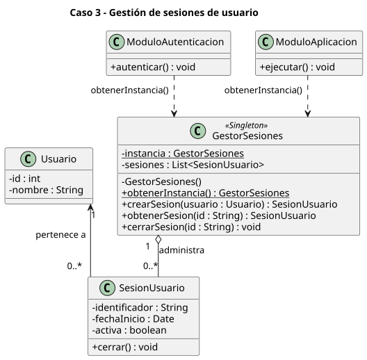

# Singleton - Actividad de clase

Cuatro casos de la diapositiva 28 (*¿Singleton?*). Cada uno se modela con un diagrama de clases UML (sin código) y se justifica si el patrón aplica. En todos, el Singleton es un **gestor** (configuración, cola de impresión, registro de sesiones, pool), y no el objeto de dominio que administra: la clase `<<Singleton>>` tiene un atributo estático `instancia`, un constructor privado y `obtenerInstancia()`, y los módulos que la usan tienen una **dependencia** (`..>`) hacia ella.

| Caso | ¿Singleton? | Qué es único |
|---|---|---|
| 1. Configuración de aplicación | Sí | La configuración cargada. |
| 2. Gestor de impresión | Sí | El gestor que coordina la impresora. |
| 3. Sesión de usuario | **No** para la sesión; sí para el gestor | `GestorSesiones`. Cada `SesionUsuario` es una instancia distinta. |
| 4. Acceso a base de datos | **No** para la conexión; sí para el pool | `PoolConexiones`. Hay muchas `Conexion`. |

```
class-activity/
├── README.md
├── configuracion-aplicacion.puml
├── gestor-impresion.puml
├── sesion-usuario.puml
├── acceso-base-datos.puml
└── diagramas/               # SVG generados
```

## Caso 1 - Configuración de aplicación

[`configuracion-aplicacion.puml`](configuracion-aplicacion.puml)


**Pregunta:** ¿justifican una única instancia de configuración? **Sí**: evita que cada módulo cargue su propia copia y vea valores distintos.

`ConfiguracionAplicacion` carga los parámetros desde un `ArchivoConfiguracion` y los entrega a `ModuloInterfaz`, `ModuloAlmacenamiento` y `ModuloReportes`. Una sola instancia evita leer el archivo varias veces y que cada módulo vea valores distintos.

## Caso 2 - Gestor de impresión

[`gestor-impresion.puml`](gestor-impresion.puml)


**Pregunta:** ¿conviene un único gestor? **Sí**: con varios gestores, los trabajos de distintos módulos competirían por la misma impresora sin una cola común.

`GestorImpresion` mantiene la cola de `TrabajoImpresion` (agregación `1 o-- 0..*`). Facturación, reportes y etiquetas envían sus trabajos al mismo gestor, de modo que la cola es única y se procesa en orden.

## Caso 3 - Gestión de sesiones de usuario

[`sesion-usuario.puml`](sesion-usuario.puml)



**Pregunta:** ¿aplicarían Singleton para representar la sesión? **No**: hay varios usuarios autenticados a la vez, y cada sesión es un objeto distinto. Lo único es el **gestor** que las registra, y por eso el Singleton es `GestorSesiones`.

`GestorSesiones` administra las `SesionUsuario` activas (agregación `1 o-- 0..*`). Cada sesión pertenece a un `Usuario`. `ModuloAutenticacion` crea sesiones y `ModuloAplicacion` las consulta, por lo que ambos necesitan el mismo registro.

## Caso 4 - Pool de conexiones a base de datos

[`acceso-base-datos.puml`](acceso-base-datos.puml)


**Pregunta:** ¿una única conexión? **No**: con muchas operaciones concurrentes una sola conexión sería un cuello de botella. La alternativa adecuada es un **pool** de conexiones, que es lo que se modela; el Singleton es el pool, no la conexión.

`PoolConexiones` administra un conjunto de `Conexion` (agregación `1 o-- 0..*`) que se prestan y se liberan. Los repositorios de clientes, pedidos y productos comparten el pool en lugar de abrir conexiones propias.

## Resumen de relaciones

| Elemento | Relación | Significado |
|---|---|---|
| Módulo `..>` Singleton | Dependencia | El módulo usa el Singleton llamando a `obtenerInstancia()`; no lo guarda como atributo. |
| Singleton `1 o-- 0..*` Elemento | Agregación | El Singleton agrupa elementos (trabajos, sesiones, conexiones) que son objetos con entidad propia. |
| `SesionUsuario 0..* --> 1 Usuario` | Asociación | Cada sesión conoce a su usuario. |
